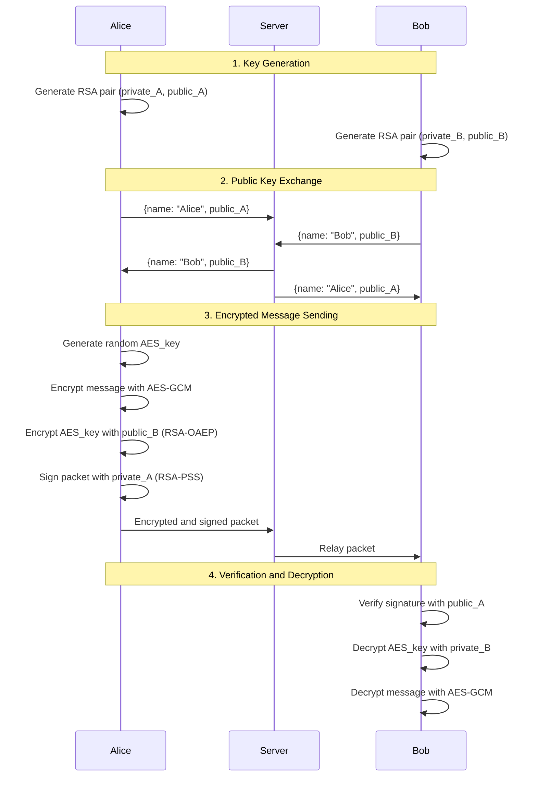
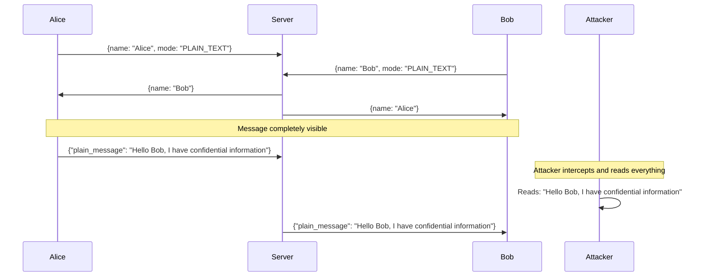

# Workshop: Network Traffic Analysis - Secure vs Insecure Communication

## Workshop Objective

This educational workshop aims to **demonstrate the importance of encryption in communications** through comparative analysis of network traffic using Wireshark. We will implement and analyze two versions of a chat system: one **secure** (with asymmetric cryptography) and another **insecure** (without encryption), to observe differences in the level of information exposure.

## Theoretical Context

### Why is encryption important?

In today's digital world, information constantly travels through networks that can be intercepted by attackers. Without adequate protection measures, sensitive data such as:

- Private conversations
- Access credentials
- Personal information
- Corporate data

Can be captured and read by anyone with network access.

### Asymmetric Cryptography: The Solution

**Asymmetric key cryptography** (also known as public key cryptography) solves this problem through:

- **Confidentiality**: Only the recipient can read the message
- **Authenticity**: The sender's identity is verified
- **Integrity**: Any message modification is detected
- **Non-repudiation**: The sender cannot deny having sent the message

## System Architecture

### Implemented Chat System

We have developed a point-to-point chat system that uses:

```
┌─────────────┐    ┌─────────────┐    ┌─────────────┐
│   Client    │◄──►│   Server    │◄──►│   Client    │
│   (Alice)   │    │   (Relay)   │    │    (Bob)    │
└─────────────┘    └─────────────┘    └─────────────┘
```

**Main components:**

- **Server**: Acts as relay, exchanges public keys and retransmits messages
- **Client**: Generates keys, encrypts/decrypts messages, handles user interface
- **Protocol**: TCP framing with length-prefix for reliable communication

## Secure Version: Cryptographic Implementation

### Security Model

The secure version implements a **hybrid scheme** that combines:

1. **RSA-2048** for asymmetric cryptography
2. **AES-256-GCM** for symmetric encryption
3. **RSA-PSS** for digital signatures

### Secure Communication Flow



### Security Features

- **Confidentiality**: Each message uses a unique AES-256 key, wrapped with RSA-OAEP
- **Authenticity**: RSA-PSS signatures guarantee sender identity
- **Integrity**: AES-GCM detects any modification
- **Persistence**: Keys are stored locally for consistent identity

## Insecure Version: Without Protection

### Educational Purpose

The insecure version **deliberately omits all cryptographic protection** to demonstrate the risks of unencrypted communications.

### Insecure Version Features

- **No encryption**: All messages travel in plain text
- **No signatures**: No authenticity verification
- **No verification**: Anyone can read or modify messages
- **Visible protocol**: The entire communication structure is observable

### Insecure Communication Flow




