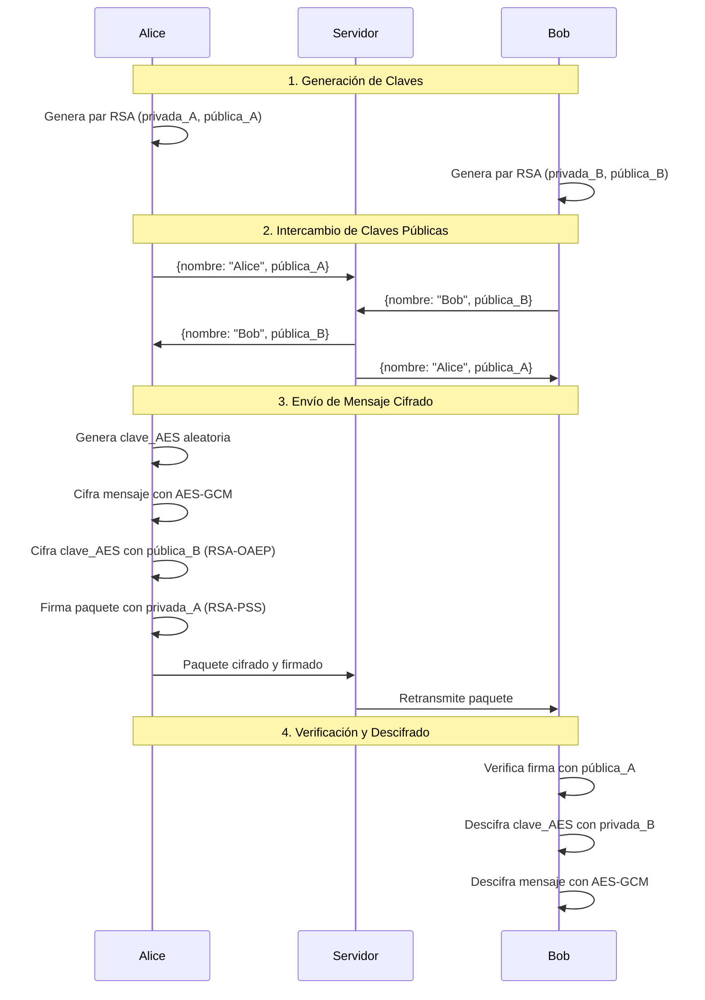
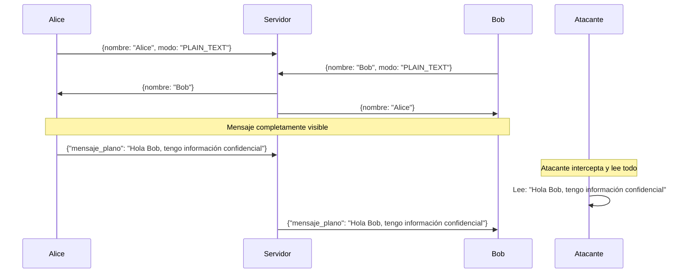

# Taller: Análisis de Tráfico de Red - Comunicación Segura vs Insegura

## Objetivo del Taller

Este taller educativo tiene como propósito **demostrar la importancia del cifrado en las comunicaciones** mediante el análisis comparativo del tráfico de red usando Wireshark. Implementaremos y analizaremos dos versiones de un sistema de chat: una **segura** (con criptografía asimétrica) y otra **insegura** (sin cifrado), para observar las diferencias en el nivel de exposición de la información.

## Contexto Teórico

### ¿Por qué es importante el cifrado?

En el mundo digital actual, la información viaja constantemente a través de redes que pueden ser interceptadas por atacantes. Sin medidas de protección adecuadas, datos sensibles como:

- Conversaciones privadas
- Credenciales de acceso
- Información personal
- Datos empresariales

Pueden ser capturados y leídos por cualquier persona con acceso a la red.

### Criptografía Asimétrica: La Solución

La **criptografía de clave asimétrica** (también conocida como criptografía de clave pública) resuelve este problema mediante:

- **Confidencialidad**: Solo el destinatario puede leer el mensaje
- **Autenticidad**: Se verifica la identidad del remitente
- **Integridad**: Se detecta cualquier modificación del mensaje
- **No repudio**: El emisor no puede negar haber enviado el mensaje

##  Arquitectura del Sistema

### Sistema de Chat Implementado

Hemos desarrollado un sistema de chat punto a punto que utiliza:

```
┌─────────────┐    ┌─────────────┐    ┌─────────────┐
│   Cliente   │◄──►│   Servidor  │◄──►│   Cliente   │
│   (Alice)   │    │   (Relay)   │    │    (Bob)    │
└─────────────┘    └─────────────┘    └─────────────┘
```

**Componentes principales:**

- **Servidor**: Actúa como relay, intercambia claves públicas y retransmite mensajes
- **Cliente**: Genera claves, cifra/descifra mensajes, maneja interfaz de usuario
- **Protocolo**: Framing TCP con longitud-prefijo para comunicación confiable

##  Versión Segura: Implementación Criptográfica

### Modelo de Seguridad

La versión segura implementa un **esquema híbrido** que combina:

1. **RSA-2048** para criptografía asimétrica
2. **AES-256-GCM** para cifrado simétrico
3. **RSA-PSS** para firmas digitales

### Flujo de Comunicación Segura



### Características de Seguridad

- **Confidencialidad**: Cada mensaje usa una clave AES-256 única, envuelta con RSA-OAEP
- **Autenticidad**: Firmas RSA-PSS garantizan la identidad del emisor
- **Integridad**: AES-GCM detecta cualquier modificación
- **Persistencia**: Las claves se almacenan localmente para identidad consistente

##  Versión Insegura: Sin Protección

### Propósito Educativo

La versión insegura **deliberadamente omite toda protección criptográfica** para demostrar los riesgos de las comunicaciones sin cifrar.

### Características de la Versión Insegura

- **Sin cifrado**: Todos los mensajes viajan en texto plano
- **Sin firmas**: No hay verificación de autenticidad
- **Sin verificación**: Cualquiera puede leer o modificar mensajes
- **Protocolo visible**: Toda la estructura de comunicación es observable

### Flujo de Comunicación Insegura




